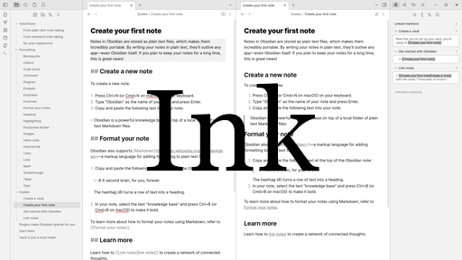

# Ink

A monochrome color scheme for Obsidian, optimized for e-ink (or e-paper) screens.

No dark theme is included, because that would not make sense on e-ink.



## How to install

Find this theme in the Obsidian's community themes browser under _Settings_ > _Appearance_ > _Themes_. If that doesn't work, double-check if you are running the latest version of Obsidian.

## How to develop

Make changes in the `scss` files and compile `theme.scss` into `theme.css` using something like [dart-sass](https://sass-lang.com/dart-sass/):

```sh
sass theme.scss theme.css
```

Add `--watch` if you want.

I use the `.vscode/tasks.json` to compile with <kbd>ctrl</kbd>+<kbd>shift</kbd>+<kbd>B</kbd> in [VSCodium](https://github.com/VSCodium/vscodium#readme).

### How to release

A [GitHub workflow](https://docs.github.com/en/actions/writing-workflows/about-workflows) runs to build a release when a tag is pushed to the repository, as described [here](https://docs.obsidian.md/Themes/App+themes/Release+your+theme+with+GitHub+Actions). To trigger that:

1. Update the version number (without a `v`) in `manifest.json`.
2. Create a tag (with `v`) with a message (without `v`) that matches the version in the `manifest.json` file and push it to GitHub:

```sh
git tag v0.1.1 --message=0.1.1
git push origin --tags
```

3. Check the result on <https://github.com/harmtemolder/obsidian-ink/releases> and publish the draft release.
